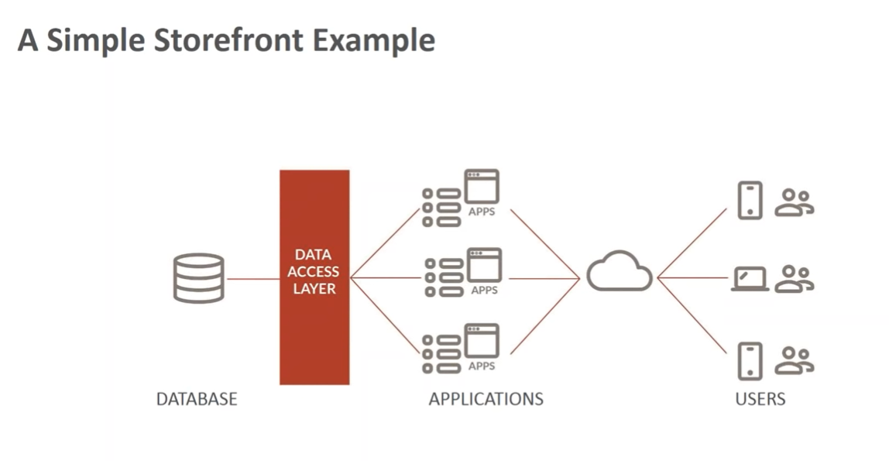
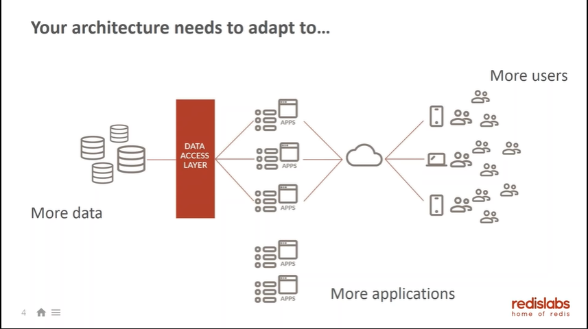
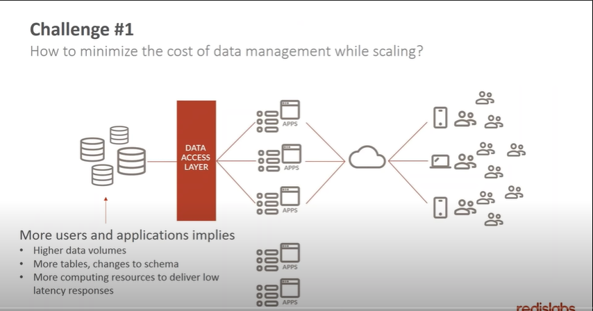
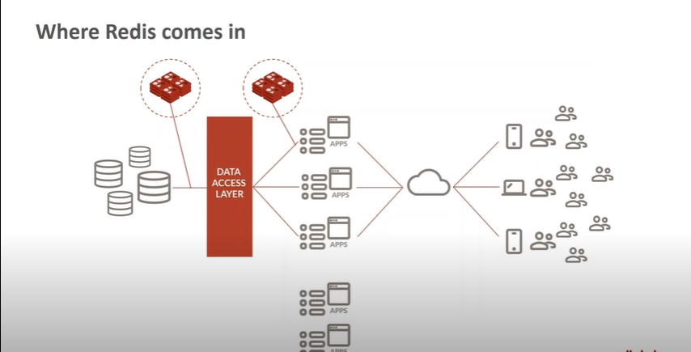
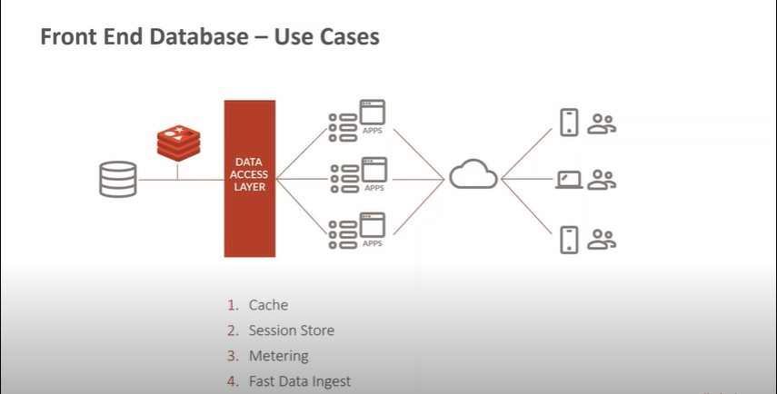
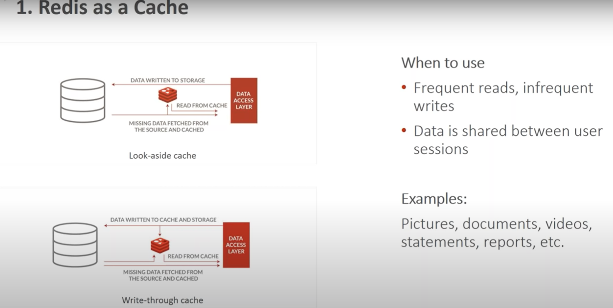
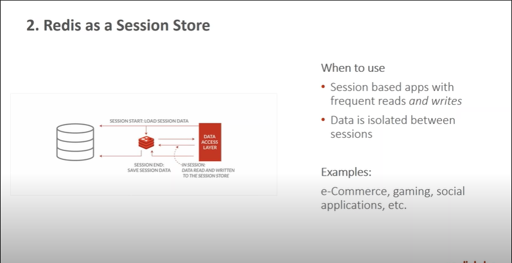
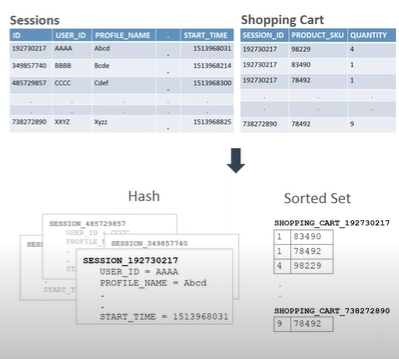
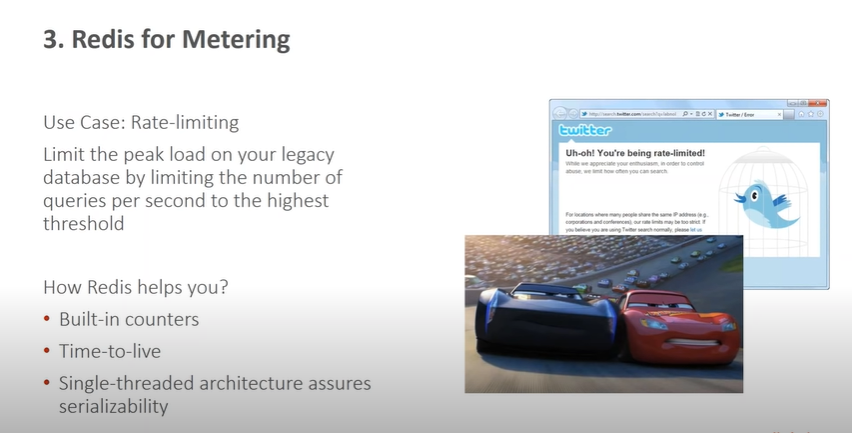
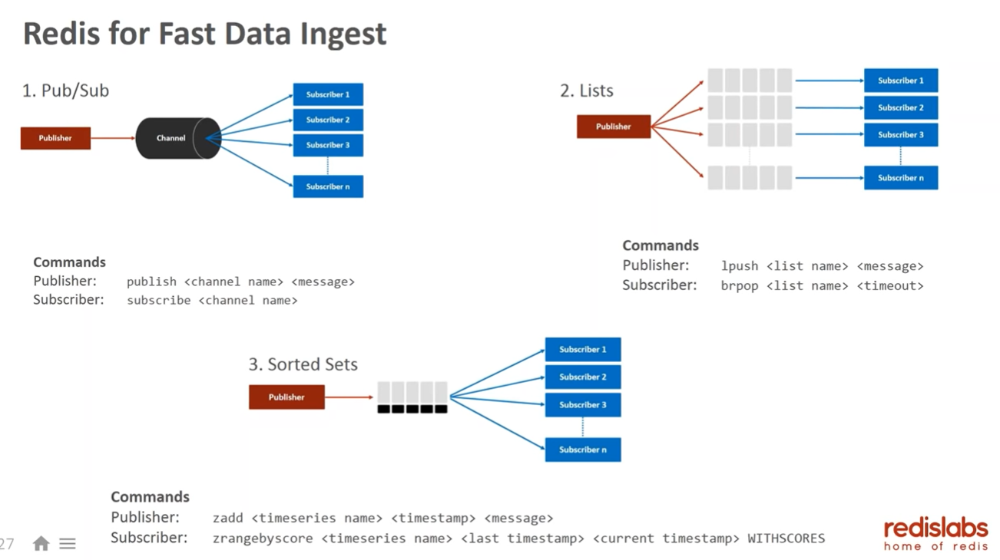

# REDIS & REDIS CLUSTER


 _*Sifat Ibna Amin*_
`

## What is *Redis?*

**Redis** is an open source (BSD licensed), in-memory data structure store, used as a database, cache and message broker. It supports data structures such as strings, hashes, lists, sets, sorted sets with range queries, bitmaps, hyperloglogs, geospatial indexes with radius queries and streams. Well in short REDIS acts as a front-end Data Server and also a Backend Data Server , depending on the use case.

```console
I know it doesn't make any sense but stay with me , i'll explain it in a bit.
```  

A simple Database structure looks like this


__*redislab*

As you can see in this Picture, a simple database structure consists of a main database , some Applications and users. The database proides services to users through Applications. But there are some drawbacks in this architecture.

Firstly what happens if the applicatons grows rapidly , and how The Database adapt with this kind of change.


__*redislab*

So one of the challenge is **how to minimize the cost of data management while scaling**


__*redislab*

As you can see more users and more applications implies ,

- Higher data volumes
- More tables, changes ,schema
- More computing resources to deliver low latency responses

and All these factors are cruical because it matter to the users who are requesting data from the database.And one second delay for one user means more times delay to more users. To overcome this Problem *REDIS* comes in handy.

So **Where RADIS come in handy?**

Redis acts like a cache or a temporary database between main database and the applications.And it handles the data transition system efficiently so that the load from the main database reduces.


__*radislab*

## How Redis overcomes this drawbacks

### Redis as a Front End Databases

Redis acts like a front end database between applications and databases.


__*redislab*

So the use cases are :

- cache
- Session Store
- Metering
- Fast Data Digest

### Cache

We all know what cache is. It's like a temporary memory like our hard disk , cache structure. So when a data is requested by the user, the apps first request the data to redis , if the data is found in redis , we call it **HIT** , the requested data returns to the requested app, if not then the redis fetches the data from the main database for the apps. The useful thing is it reduces latency and serves more faster than a simple database architectre. Here is a simple architecture for radis a cache


__*radislab*

Using data structures and algorithms like Hashing, Sorted Set , data stays in an organized way in the cache.

### Redis as a Session Store

When an app frequently requests data , redis keeps track using session Strore feature. The idea is Redis stores the session of an app and when an app requests the same data from the main database radis can easily gives responses as it know, where to look at the data.


__*redislab*

Like cache architecture it also uses Data Structures and additionally it creates a session table for each session number.



### REDIS for metering

Redis uses limited number of queries on a given time. And by limiting number of queries it can give responses much faster than the main database. And redis has some built in functionality optimizes this process.


__*radislab*

so how does this rate limiting works? Here is some example [code](https://github.com/redislabsdemo/RateLimiter) of how ratelimited works. Have a take a look if you are interested to know more.

```console
As it's just an introductory blog of how radis works i won't discuss it in details.
````

### REDIS for fast Data Ingest

As redis works as a middle man between the main server and the applications , radis deal with a lot of data. And Radis does it so efficiently by using arcitures like

- pub/sub
- list
- sorted list


__*radislab*

A simple way to think it like , when a publisher publish a book or an aritcle it reaches many subscriber , so like this Redis acts as a **Publisher** and the applications acts as a **Subscriber**. And Redis has to deal with a lot subscriber apps and provide them services in real time.

So Redis provides many varities of services and it makes the data exchange between the applications and main database so smoothly and efficiently.
